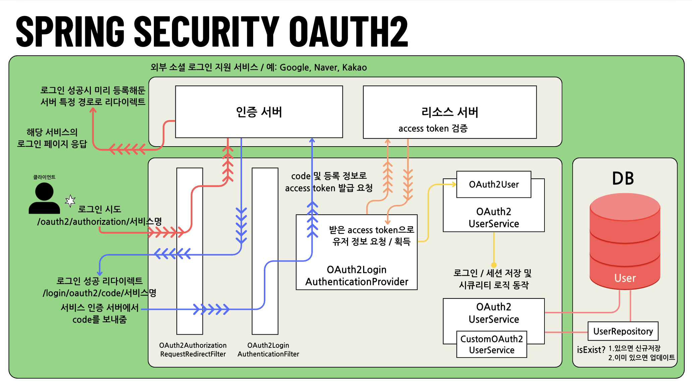

# 🔐 Spring Security 실습 시리즈

이 저장소는 Spring Security를 기반으로 다양한 인증/인가 방식을 실습한 모노레포 구조입니다.  
기초부터 JWT, OAuth2까지 단계적으로 구성되어 있으며, 각 디렉토리는 개별 프로젝트로 분리되어 있습니다.

---

## 🧩 OAuth2 소셜 로그인 인증 흐름도

> `spring-security-oauth2` 프로젝트에서 구현된 **Spring Security 기반 OAuth2 인증 흐름**입니다.



### ✅ 인증 흐름 요약

1. 사용자가 `/oauth2/authorization/{provider}`로 로그인 요청
2. 인증 서버(Google, Naver, Kakao 등)로 리디렉션
3. 인증 후 `code`를 포함한 응답을 `/login/oauth2/code/{provider}`로 수신
4. Spring Security가 access token 요청 → 사용자 정보 요청
5. 커스텀 `OAuth2UserService`에서 사용자 DB 저장 (신규 or 업데이트)
6. 인증 완료 후 세션/컨텍스트 저장 및 로그인 완료

📂 자세한 구현: [`spring-security-oauth2-client-session`](./spring-security-oauth2-client-session)

---

## 📁 프로젝트 구성

| 디렉토리 | 설명 |
|----------|------|
| `spring-security-basic/` | Form 로그인, 인증/인가 기본 개념 학습 |
| `spring-security-jwt/`   | JWT 기반 로그인 구현 및 필터 체인 구성 |
| `spring-security-oauth2-client-session/`| Google, Naver, Kakao 연동 소셜 로그인 구현 |

---

## ✨ 기술 스택

- Spring Boot 3+
- Spring Security
- OAuth2 Client (구글/네이버/카카오)
- Mustache (UI 템플릿)
- MySQL (DB)
- JPA, Lombok

---

## 👨‍💻 실행 방법

```bash
# 원하는 디렉토리로 이동하여 실행
cd spring-security-oauth2
./gradlew bootRun